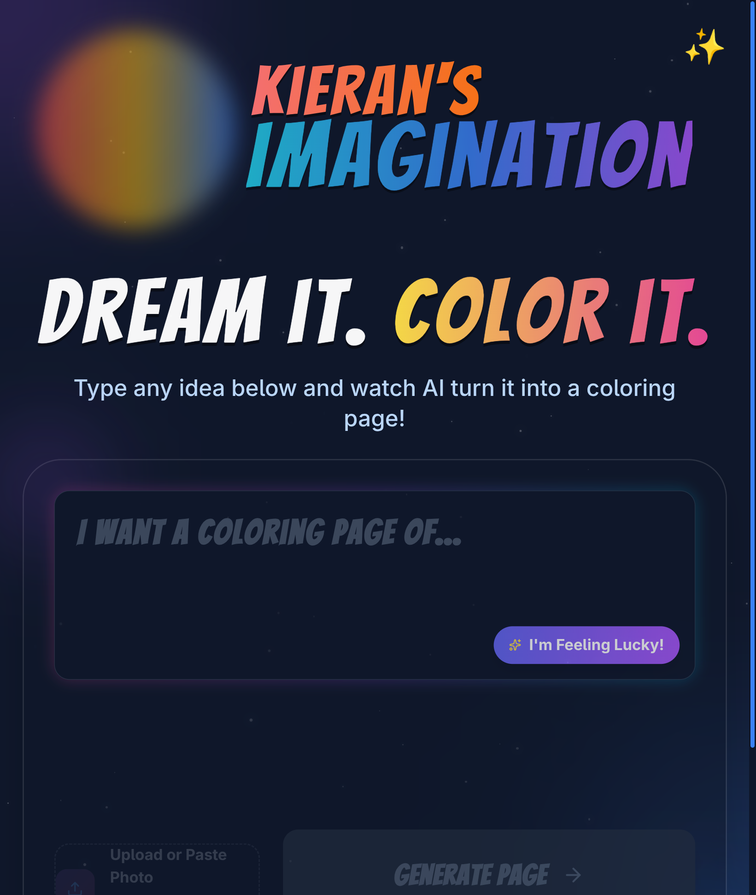

# Kieran's Imagination

Kieran's Imagination is an AI-powered coloring page generator for kids and families. Describe an idea, optionally upload or paste a photo, and the app generates a printable black-and-white coloring page through Gemini-backed image generation.

Live site: [kieran.app](https://kieran.app)



## What It Does

- Turns text prompts into printable coloring pages
- Converts uploaded or pasted photos into line-art pages
- Improves short prompts before generation
- Offers rotating prompt suggestions for kids who need a starting point
- Saves generated images to Cloudflare R2
- Shares generated pages through native mobile sharing where available
- Supports AI edit actions such as enhancing detail or fixing accidental coloring
- Includes a community "Hot or Not" gallery route at `/hot`
- Includes a trading-card generator route at `/cards`

## Architecture

The app is a Vite/React frontend deployed on Cloudflare Pages with Pages Functions for the API layer.

```text
React app
  -> Cloudflare Pages Functions
      -> Gemini image/text APIs
      -> Cloudflare R2 for generated images
      -> Cloudflare D1 for metadata, votes, and request logs
```

Key paths:

- `App.tsx` - top-level routing and view state
- `components/Generator.tsx` - prompt input, photo upload, suggestions, and generation flow
- `components/Preview.tsx` - generated image display, share, edit, and download actions
- `components/Editor.tsx` - coloring editor
- `components/HotOrNot.tsx` - community voting surface
- `components/cards/` - trading card generator UI
- `functions/api/generate.ts` - coloring page generation endpoint
- `functions/api/edit.ts` - AI edit endpoint
- `functions/api/images.ts` and `functions/api/images/view.ts` - R2 image persistence
- `functions/api/hot.ts` - voting endpoints
- `functions/api/cards/` - trading card generation and editing endpoints
- `migrations/` - Cloudflare D1 schema migrations

## Tech Stack

| Layer | Technology |
|---|---|
| Frontend | React 19, Vite, TypeScript |
| Styling | Tailwind CSS, Framer Motion |
| Icons | lucide-react |
| Runtime | Cloudflare Pages |
| API | Cloudflare Pages Functions |
| AI | Google Gemini via `@google/genai` |
| Storage | Cloudflare R2 |
| Database | Cloudflare D1 |
| Package manager | Bun 1.3.3 |
| Tests | Vitest, Testing Library |

## Local Development

Install dependencies:

```bash
bun install
```

Create `.dev.vars` for Cloudflare Pages Functions:

```bash
GEMINI_API_KEY=your_api_key_here
GEMINI_IMAGE_MODEL=gemini-3-pro-image-preview
```

Build the frontend before starting the Pages dev server:

```bash
bun run build
bun run dev
```

Run the test suite:

```bash
bun run test
```

## Cloudflare Resources

Configured in [`wrangler.toml`](wrangler.toml):

| Binding | Type | Resource | Purpose |
|---|---|---|---|
| `IMAGES_BUCKET` | R2 | `kieran-images` | Store generated images |
| `DB` | D1 | `kieran-db` | Store image metadata, votes, and request logs |

Apply D1 migrations locally:

```bash
npx wrangler d1 migrations apply kieran-db --local
```

Apply D1 migrations to production:

```bash
npx wrangler d1 migrations apply kieran-db --remote
```

## Deployment

The production app is deployed to Cloudflare Pages as `kieran-app`.

Check recent deployments:

```bash
npx wrangler pages deployment list --project-name kieran-app
```

Manual deploy:

```bash
bun run build
npx wrangler pages deploy dist --project-name kieran-app
```

Tail production logs:

```bash
npx wrangler pages deployment tail --project-name kieran-app
```

## API Surface

| Endpoint | Method | Description |
|---|---|---|
| `/api/generate` | POST | Generate a coloring page from a prompt or uploaded image |
| `/api/edit` | POST | Edit an existing generated image |
| `/api/upscale` | POST | Upscale image resolution |
| `/api/images` | POST | Save image data to R2 |
| `/api/images/view` | GET | Serve an image from R2 |
| `/api/suggestions` | GET | Return prompt suggestions |
| `/api/improve-prompt` | POST | Expand a short prompt into a stronger generation prompt |
| `/api/hot` | GET/POST | Community voting data |
| `/api/cards/generate` | POST | Generate trading card art |
| `/api/cards/edit` | POST | Edit trading card art |

## Validation Evidence

The live site was pre-flighted on May 16, 2026:

```text
https://kieran.app -> HTTP 200 text/html; charset=utf-8
```

The screenshot in this README was captured from the live site with the connected browser bridge.
